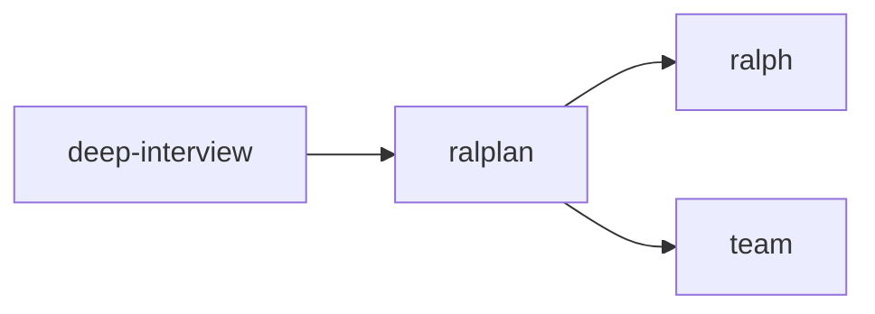
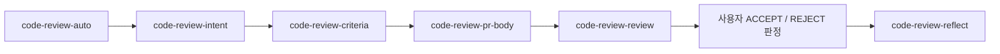
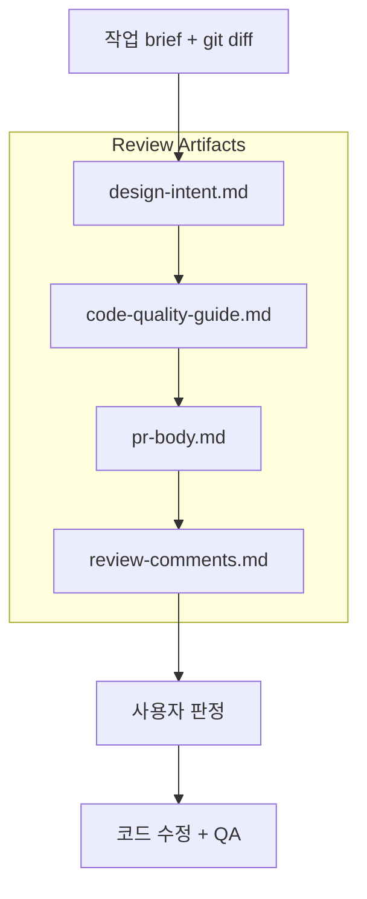

# AX-WMS Skill Reference

AX-WMS 저장소에서 자주 쓰는 skill을 **한 파일에서 빠르게 찾기 위한 참조 문서**다.
상세 내부 절차는 각 `SKILL.md`가 source of truth이며, 이 문서는 **무엇을 언제 어떻게 쓰는지**를 빠르게 찾는 데 집중한다.

## OMX 추천 절차

> 아래 순서는 **보통 추천하는 기본 흐름**이다. 작업이 이미 매우 명확한 경우에는 일부 단계를 생략할 수 있지만, 애매한 작업일수록 이 순서를 따르면 안전하다.

| 단계 | 보통 이렇게 쓴다 |
|---|---|
| 1. 요구사항 정리 | 먼저 `deep-interview`로 의도, 범위, non-goals를 명확히 한다 |
| 2. 계획 합의 | 더 명확한 실행 기준이 필요하면 `ralplan`으로 계획을 다듬는다 |
| 3-A. 단일 실행 | 한 사람이 끝까지 밀어붙이는 비교적 좁은 작업이면 `ralph`로 실행한다 |
| 3-B. 병렬 실행 | 병렬 lane이 필요한 큰 작업이면 `team`으로 실행한다 |

한 줄로 요약하면 **`deep-interview → ralplan → ralph/team`** 이 현재 문서에서 추천하는 기본 절차다.

## 빠른 선택 가이드

| 상황 | 추천 skill | 이유 |
|---|---|---|
| 요구사항이 모호해서 먼저 정리해야 함 | `deep-interview` | 왜 하는지, 어디까지 할지, 무엇을 빼야 하는지 먼저 명확하게 만든다 |
| 구현 전에 계획을 세우고 싶음 | `plan` | 구조화된 실행 계획을 만든다 |
| 여러 관점 합의가 필요한 계획 수립 | `ralplan` | Planner / Architect / Critic 합의 기반 계획으로 이어진다 |
| 아이디어부터 구현/검증까지 한 번에 맡기고 싶음 | `autopilot` | 계획, 구현, QA, 검증을 한 번에 다루는 전자동 흐름이다 |
| 한 사람이 끝까지 밀어붙여 완성해야 함 | `ralph` | 완료 증거와 검증까지 포함한 지속 실행 루프에 강하다 |
| 병렬 작업이 유리한 큰 작업 | `team` | tmux 기반 협업 워커를 띄워 병렬로 진행한다 |
| 코드리뷰 준비를 한 번에 끝내고 싶음 | `code-review-auto` | 설계의도 → 평가기준 → PR 본문 → 리뷰 → 반영 흐름을 순차 오케스트레이션한다 |
| 브랜치 이름을 정해야 함 | `git-branch-naming` | AX-WMS 브랜치 전략에 맞는 이름을 빠르게 추천한다 |
| 커밋 메시지를 작성해야 함 | `git-commit` | 프로젝트 규칙에 맞는 Conventional Commit 형식으로 정리한다 |
| PR 제목/본문을 정리해야 함 | `git-pr` | 리뷰어가 이해하기 쉬운 PR 문안을 빠르게 만든다 |

## 문서 범위

- **Project-local skill 10개**
  - `code-review-auto`
  - `code-review-criteria`
  - `code-review-docs`
  - `code-review-intent`
  - `code-review-pr-body`
  - `code-review-reflect`
  - `code-review-review`
  - `git-branch-naming`
  - `git-commit`
  - `git-pr`
- **핵심 OMX skill 6개**
  - `deep-interview`
  - `plan`
  - `ralplan`
  - `autopilot`
  - `ralph`
  - `team`

## 공통 사용 규칙

- 명시 호출은 보통 `$skill-name` 형태를 쓴다.
- 이 저장소 전용 skill은 `.codex/skills/` 아래에 있다.
- OMX 공용 핵심 skill은 `/home/port/.codex/skills/` 아래 정의되어 있다.
- 더 자세한 규칙, 예외, 세부 절차는 각 skill의 `SKILL.md`를 기준으로 본다.

---

## Code Review Skills

### 전체 흐름

위 흐름은 `code-review-auto`가 순차적으로 묶어 주는 **메인 리뷰 파이프라인**이다.

### artifact / handoff 흐름

아래 흐름은 각 단계에서 만들어지는 문서 산출물과 사용자 판정이 어떻게 이어지는지 보여준다.

### `code-review-auto`
- **무엇인지**: 코드리뷰 전체 파이프라인을 순차적으로 오케스트레이션하는 진입점
- **언제 사용하는지**: 구현이 끝난 feature branch에서 리뷰 준비를 한 번에 정리하고 싶을 때
- **어떻게 사용하는지**: branch/base/diff를 확인한 뒤 하위 code-review skill을 순서대로 실행한다
- **예시**: `$code-review-auto`
- **핵심 포인트**: 병렬 실행이 아니라 **한 단계씩 순차 진행**한다

### `code-review-intent`
- **무엇인지**: 작업 brief와 git diff를 바탕으로 설계의도 문서를 만드는 skill
- **언제 사용하는지**: 리뷰 전에 “왜 이렇게 설계했는가”를 먼저 공유해야 할 때
- **어떻게 사용하는지**: 요구사항, 설계 결정, 트레이드오프를 요약한 뒤 `design-intent.md`를 생성한다
- **예시**: `$code-review-intent`
- **산출물**: `.codex/review-artifacts/{branch}/design-intent.md`

### `code-review-criteria`
- **무엇인지**: ADR과 code convention을 합쳐 이번 작업 전용 평가기준을 만드는 skill
- **언제 사용하는지**: 리뷰 전에 어떤 기준으로 PR을 볼지 먼저 합의하고 싶을 때
- **어떻게 사용하는지**: `docs/{module}/adr.yaml`과 `docs/{module}/code-convention.yaml`에서 관련 항목만 추려 `code-quality-guide.md`를 만든다
- **예시**: `$code-review-criteria`
- **산출물**: `.codex/review-artifacts/{branch}/code-quality-guide.md`

### `code-review-pr-body`
- **무엇인지**: git diff와 앞선 산출물을 바탕으로 PR 본문 초안을 만드는 skill
- **언제 사용하는지**: `gh pr create` 직전 리뷰어용 설명을 빠르게 정리해야 할 때
- **어떻게 사용하는지**: diff/stat/name-only와 설계의도/평가기준을 조합해 Summary, Changes, Breaking Changes, Test Plan을 채운다
- **예시**: `$code-review-pr-body`
- **산출물**: `.codex/review-artifacts/{branch}/pr-body.md`

### `code-review-review`
- **무엇인지**: 설계의도, 평가기준, PR 본문, diff를 근거로 실제 리뷰 코멘트를 생성하는 skill
- **언제 사용하는지**: 준비된 산출물을 바탕으로 근거 기반 코드리뷰를 수행할 때
- **어떻게 사용하는지**: `review-comments.md`에 p1~p4 우선순위와 근거, side effect, 사용자 판정 placeholder를 남긴다
- **예시**: `$code-review-review`
- **산출물**: `.codex/review-artifacts/{branch}/review-comments.md`

### `code-review-reflect`
- **무엇인지**: 리뷰 코멘트 중 사용자가 `ACCEPT`한 항목만 반영하고 QA까지 수행하는 skill
- **언제 사용하는지**: 리뷰 결과를 코드에 실제 반영해야 할 때
- **어떻게 사용하는지**: `review-comments.md`의 `ACCEPT / REJECT` 판정을 읽고 수정 → 테스트/빌드 → 실행 결과 기록 순으로 진행한다
- **예시**: `$code-review-reflect`
- **주의**: code-review 파이프라인에서 **유일하게 소스코드를 수정**하는 단계다

### 파이프라인 바깥의 지원 skill

### `code-review-docs`
- **무엇인지**: `docs/{module}/adr.yaml`과 `docs/{module}/code-convention.yaml`을 같이 업데이트하는 docs 정합성 유지 skill
- **언제 사용하는지**: 새 ADR 채택, convention 변경, 기존 결정 폐기 등으로 두 문서 간 충돌을 함께 봐야 할 때
- **어떻게 사용하는지**: 두 문서를 모두 읽은 뒤 MUST / RECOMMENDED 변경 제안을 만들고 확정 후 반영한다
- **예시**: `$code-review-docs --module api`
- **핵심 포인트**: 메인 리뷰 파이프라인 단계라기보다, **리뷰 기준 문서와 ADR/convention 정합성**을 맞출 때 쓰는 주변 지원 skill이다

## Code Review 단계별 선택 팁

| 지금 필요한 것 | 선택할 skill |
|---|---|
| 전체 리뷰 준비를 처음부터 끝까지 | `code-review-auto` |
| 설계 의도 문서만 먼저 | `code-review-intent` |
| 리뷰 기준만 정리 | `code-review-criteria` |
| PR 본문만 작성 | `code-review-pr-body` |
| 실제 리뷰 코멘트 생성 | `code-review-review` |
| 리뷰 반영 + QA | `code-review-reflect` |
| ADR / convention 문서 정리 | `code-review-docs` |

---

## Git Workflow Skills

### `git-branch-naming`
- **무엇인지**: AX-WMS 브랜치 전략과 네이밍 규칙을 안내하는 skill
- **언제 사용하는지**: 어떤 브랜치를 파야 할지, 브랜치명을 어떻게 지을지 고민될 때
- **어떻게 사용하는지**: 작업 유형(`feat/fix/chore/...`) + 영역(`web/api/ai/infra/docs/agent`) + topic 구조로 추천을 받는다
- **예시**: `$git-branch-naming ㅁㅁ 작업 할건데 브랜치명 추천해줘`
- **빠른 예시 이름**: `feat/web/login-flow`, `docs/agent/skills-reference`

### `git-commit`
- **무엇인지**: 프로젝트 규칙에 맞는 Conventional Commit 스타일 커밋 메시지를 만드는 skill
- **언제 사용하는지**: 변경 내용을 어떤 type/scope/subject로 커밋할지 정리할 때
- **어떻게 사용하는지**: 변경 범위를 요약하고 `feat`, `fix`, `docs`, `refactor` 등 적절한 타입과 scope를 골라 메시지를 만든다
- **예시**: `$git-commit`
- **핵심 포인트**: 한글 subject, 짧은 제목, 필요 시 본문 추가라는 프로젝트 규칙을 따른다

### `git-pr`
- **무엇인지**: PR 제목과 본문을 AX-WMS 스타일에 맞게 정리하는 skill
- **언제 사용하는지**: 리뷰어가 빠르게 이해할 수 있는 PR 설명이 필요할 때
- **어떻게 사용하는지**: `[Type(scope)]: subject` 제목과 템플릿 기반 본문(`Type of change`, `Motivation`, `Problem Solving`, `To Reviewer`)을 만든다
- **예시**: `$git-pr`
- **핵심 포인트**: 커밋 메시지보다 **리뷰어 이해와 검색성**을 더 우선한다

---

## 확인용 체크리스트

- [ ] 지금 필요한 게 **코드리뷰 문서화와 반영**인가? → `code-review-*`
- [ ] 지금 필요한 게 **Git 브랜치 / 커밋 / PR 정리**인가? → `git-*`

## Source of Truth

- project-local skill: `.codex/skills/*/SKILL.md`
- OMX core skill: `/home/port/.codex/skills/*/SKILL.md`
- 문서 전략 참고: `docs/docs-strategy.md`
